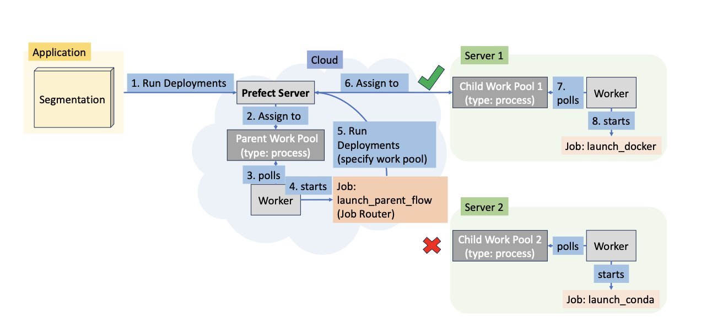
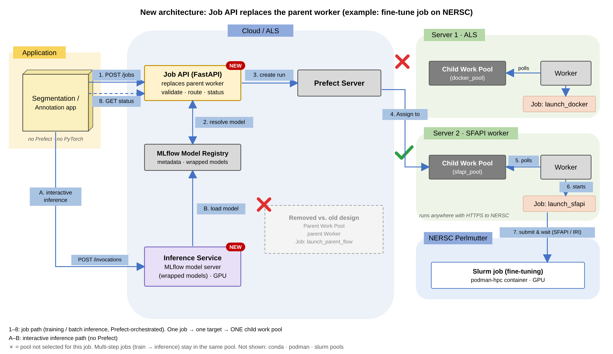

# Architecture: old vs. new Prefect worker

This page compares the current `mlex_prefect_worker` design with this refactor.
In short, the **parent worker is replaced by a FastAPI Job API**, the child
workers stay almost the same (plus an **SFAPI worker for NERSC**), and
**interactive inference** gets its own endpoint outside Prefect.

## Old architecture (mlex_prefect_worker)



| Step | What happens |
|---|---|
| 1 | The app calls Prefect `run_deployment("Parent flow/launch_parent_flow", params_list)` |
| 2–4 | Prefect assigns the run to the **Parent Work Pool**. The **parent worker** polls it and starts `launch_parent_flow` (the "Job Router") |
| 5 | The parent flow looks up the model in MLflow, picks an environment from `worker.name` in `config.yml`, and calls `run_deployment` for a child flow |
| 6–8 | Prefect assigns the child run to one child pool (docker ✓, conda ✗ in the picture). That worker polls it and starts `launch_docker` |
| – | The parent flow **stays running** and polls every 60 s until the child finishes, then starts the next step |

## New architecture (prefect_worker_refactor)



The diagram shows the annotation-app case: a **fine-tuning job on NERSC**.
A job has **one target**, so it uses **exactly one child work pool**: here
`sfapi_pool` ✓. The docker pool on Server 1 ✗ is not used for this job, the
same way the old design used only one child pool.

| Step | What happens | Code |
|---|---|---|
| 1 | The app sends `POST /api/v1/jobs` with `"target": "nersc"` and an API key | `job_api/main.py` |
| 2 | The Job API resolves each step's model in the MLflow registry (image, python files, GPU flag) | `job_api/mlflow_lookup.py` |
| – | It maps the job's target to **one** flow type (`nersc` → sfapi) and validates every step with the child-flow schema. Errors come back as 4xx right away | `job_api/routing.py` |
| 3 | It creates the flow run on the `launch_sfapi` deployment, tagged `mlex-job:<id>` | `job_api/prefect_gateway.py` |
| 4–6 | Prefect assigns the run to `sfapi_pool`. The SFAPI worker polls it and starts `launch_sfapi` | `worker/flows/sfapi/` |
| 7 | `launch_sfapi` submits a Slurm job to Perlmutter through **SFAPI or the IRI API** and waits. The run fails unless the job completed | `sfapi_flows.py` |
| 8 | The app polls `GET /api/v1/jobs/{id}` for the status and `result_uid` | `job_api/main.py` |
| A–B | For interactive inference (one slice, a few seconds), the app calls the **inference service** directly. It serves the wrapped models from the MLflow registry (`mlflow models serve`, `/invocations`). Prefect is not involved | `inference_service/` |

**Multi-step jobs** (for example train → inference) stay in the **same pool**:
when step 0 succeeds, `launch_sfapi` submits step 1 to `launch_sfapi` again
(`worker/flows/chain.py`). A job never moves to a different pool.

## What changed

| | Old | New |
|---|---|---|
| **Entry point for apps** | Prefect `run_deployment` on the parent flow (the app needs the Prefect client) | HTTP `POST /api/v1/jobs` (the app needs only `httpx`) |
| **Job router** | `launch_parent_flow`, a Prefect flow on its own **parent worker and pool** | **Job API** (FastAPI). It is a plain service, not a Prefect flow |
| **Errors such as an unknown model, missing conda env or bad target** | Show up as a failed parent run in the Prefect UI | Rejected immediately with 404/422. Nothing is submitted |
| **Choosing compute** | One global `worker.name` in `config.yml` | One `target` **per job** (one child work pool), limited by `allowed_targets`. Different jobs can use different pools |
| **Multi-step jobs** | The parent flow runs the steps in a loop and blocks a worker slot while it polls | Each child flow submits the next step **to the same pool** when it succeeds (`next_steps`), so nothing waits idle |
| **Job status** | Find the parent run in the Prefect UI | `GET /api/v1/jobs/{id}` (built from Prefect runs tagged `mlex-job:<id>`) |
| **Cancel** | Through the Prefect UI | `DELETE /api/v1/jobs/{id}` |
| **Auth** | Anyone who can reach the Prefect API | `X-API-Key` per app, recorded as the tag `mlex-client:<name>` |
| **NERSC** | `slurm` flow running `sbatch` on a cluster login node | **SFAPI worker** that runs anywhere with HTTPS. It logs in with SFAPI or the IRI API (Globus) and runs the container with podman-hpc |
| **Interactive inference** | Done in the app backend or a heavy flow (PyTorch in the backend) | Separate **inference service** (MLflow model server with wrapped models) |
| **Where PyTorch is installed** | App backends and some flows | Only the algorithm images (run as jobs) and the inference service |
| **MLflow lookup** | `get_latest_versions()`, which is deprecated | `search_model_versions()`, plus an optional `model_version` |

## What stays the same

- **Prefect server, work pools, process workers and `prefect deploy`.**
- **Child flows** `launch_docker`, `launch_podman`, `launch_conda` and `launch_slurm`. Their only change is the extra `next_steps` argument.
- **The `uid_save` → `uid_retrieve` contract** between steps, and credentials being added on the worker (they never come from clients).
- **The old payload.** `{"params_list": [...]}` is still accepted by `POST /api/v1/jobs`.

## Migrating an app

```python
# Old: the app needs Prefect and a parent worker must be running
flow_run = await run_deployment("Parent flow/launch_parent_flow",
                                parameters={"params_list": params_list})

# New: one HTTP call; same payload
r = httpx.post(f"{JOB_API}/api/v1/jobs", json={"params_list": params_list},
               headers={"X-API-Key": KEY})
job_id = r.json()["job_id"]
status = httpx.get(f"{JOB_API}/api/v1/jobs/{job_id}", headers={"X-API-Key": KEY}).json()
```

For workers:

1. Stop the parent worker (`start_parent_worker.sh`).
2. Start the Job API (`job_api/start_job_api.sh`).
3. Keep the child workers running, and add `worker/start_sfapi_child_worker.sh` for NERSC.

## Trade-offs and open points

- **Chaining moved into the child flows.** If a worker crashes between finishing a step and submitting the next one, the job stops there and shows as failed or crashed. It does not resume by itself. Prefect Automations are an alternative to compare (see `docs/DESIGN.md`).
- **Cancelling a NERSC step** stops the Prefect run, but not a Slurm job that was already submitted (`scancel` hook still to do).
- **API keys are temporary.** Computing Hub identity (OIDC or Globus) is the long-term option.

To edit the new diagram, change `docs/images/draw_architecture_new.py`, then run it to regenerate `architecture_new.svg` and re-render the PNG from the SVG.
